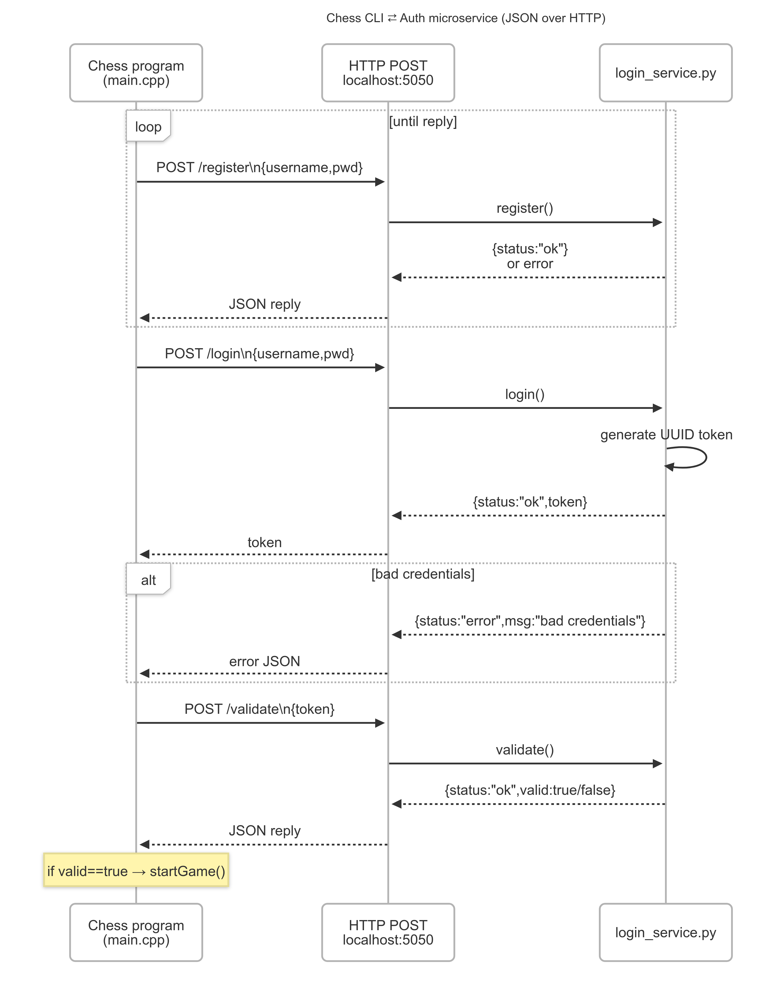

Small Python HTTP service that stores user accounts
locally and lets any program create and validate logins.  
All calls use JSON over HTTP at **http://localhost:5050**.

Folder map
* login_service.py     – Python server  
* chess_users.json     – local user database 
* auth.hpp / auth.cpp  – C++ helpers
* test_auth.cpp        - test program  

----------------------------------------------------------------------
# How to run

1. Start server in its folder  
python login_service.py 

The console prints  
`Auth service running on http://localhost:5050`

2. Build app 
g++ -std=c++17 test_auth.cpp auth.cpp -lcurl -o test_auth

----------------------------------------------------------------------
All requests are HTTP POST with header  
`Content-Type: application/json`

# Route list:
* **/register**  body `{ "username":"u", "password":"p" }`  
              reply `{ "status":"ok" }`
* **/login**     body `{ "username":"u", "password":"p" }`  
              reply `{ "status":"ok", "token":"<uuid>" }`
* **/validate**  body `{ "token":"<uuid>" }`  
              reply `{ "status":"ok", "valid": true | false }`

----------------------------------------------------------------------
# Request & Receive Data

Programmatic **request** 
```cpp
nlohmann::json body = {{"username","user"}, {"password","password123"}};

curl_easy_setopt(curl, CURLOPT_URL,
                 "http://localhost:5050/login");
curl_easy_setopt(curl, CURLOPT_POSTFIELDS, body.dump().c_str());
curl_easy_setopt(curl, CURLOPT_POSTFIELDSIZE, body.dump().size());
```

Programmatic **receive** 
```cpp
std::ostringstream resp;
curl_easy_setopt(curl, CURLOPT_WRITEFUNCTION, writeCB);
curl_easy_setopt(curl, CURLOPT_WRITEDATA, &resp);
curl_easy_perform(curl);

auto j = nlohmann::json::parse(resp.str());
std::string token = j.value("token", "");   
```
----------------------------------------------------------------------
# UML Sequence Diagram


----------------------------------------------------------------------
